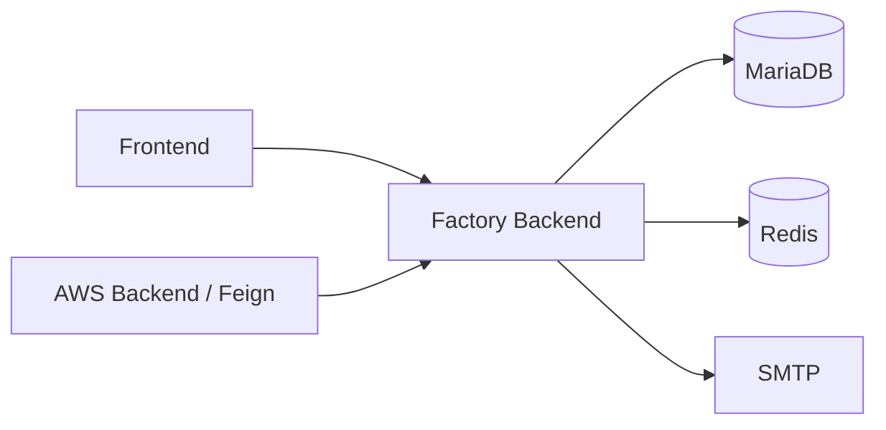

# Factory Tycoon - Backend

[한국어](README.md) | **English**

Factory Tycoon is a team project that connects factory operations, IoT sensor monitoring, anomaly detection, and AI analysis. Its repositories cover data collection, backend services, the web interface, and cloud deployment.

**The Spring Boot REST API for factory operations.** It manages the factory, equipment, work, sensor, and alert data used by the frontend and AI service, and provides user authentication.

## Implementation highlights

- **Operations model**: APIs for factories, equipment, work orders, orders, inventory, and schedules
- **Sensors and alerts**: management of sensor data, analysis results, alerts, and prediction records
- **Authentication and accounts**: JWT issuance and validation, Redis token storage, and email verification
- **Persistence**: relational data access through JPA and SQL migrations through Flyway
- **API documentation**: Springdoc OpenAPI and Swagger UI

## Service role



This service owns operations data. The separate AWS backend handles Bedrock calls and file storage.

## Stack

Java 17, Spring Boot 3.5.8, Spring Data JPA, MariaDB, Redis, Flyway, JWT, Docker

## Run locally

Install JDK 17 and Docker Compose. Create `.env` in the repository root. The database values below are development examples matching the included local Compose configuration.

```dotenv
MARIADB_URL=jdbc:mysql://localhost:3306/factory-tycoon
MARIADB_USERNAME=user
MARIADB_PASSWORD=1234
REDIS_HOST=localhost
REDIS_PORT=6379
JWT_SECRET_KEY=replace-with-a-long-random-secret-for-local-development
JWT_ACCESS_TTL_MS=3600000
JWT_REFRESH_TTL_MS=86400000
SPRING_MAIL_HOST=your-smtp-host
SPRING_MAIL_USERNAME=your-smtp-username
SPRING_MAIL_PASSWORD=your-smtp-password
```

Replace the SMTP values with your mail server settings. See [application.yaml](src/main/resources/application.yaml) for the full configuration.

Run from the repository root:

```bash
docker compose -f docker/local/docker-compose.yml up -d mariadb redis
./gradlew bootRun
```

- API: `http://localhost:8080`
- Swagger UI: `http://localhost:8080/swagger-ui/index.html`
- Tests: `./gradlew test` — tests that load the application context require the corresponding configuration and services.

## Explore the code

- [src/main/java/com/factory/tycoon](src/main/java/com/factory/tycoon): controllers, services, repositories, and domain types grouped by feature
- [auth](src/main/java/com/factory/tycoon/auth): JWT and Redis token handling
- [db/migration](src/main/resources/db/migration): database migrations
- [docker/local](docker/local): local databases, cache, and backup configuration

## Deployment

[GitHub Actions](.github/workflows/deployment.yml) is configured to publish container images to ECR and update the Helm image tag in the Kubernetes repository. Deployment uses the Kubernetes and Cloud repositories together. The workflow still references the previous organization (`lgcns5team`); check repository destinations and Secrets before reusing it.

## Related repositories

| Repository | Role |
| --- | --- |
| [factory-tycoon-frontend](https://github.com/factorytycoon/factory-tycoon-frontend) | Web dashboard and 3D factory visualization |
| [factory-tycoon-backend](https://github.com/factorytycoon/factory-tycoon-backend) | Factory operations and authentication API |
| [factory-tycoon-backend-aws](https://github.com/factorytycoon/factory-tycoon-backend-aws) | Bedrock AI analysis and S3/OpenSearch integration |
| [factory-tycoon-backend-websocket](https://github.com/factorytycoon/factory-tycoon-backend-websocket) | Live sensor and alert delivery |
| [factory-tycoon-sensor-simulator](https://github.com/factorytycoon/factory-tycoon-sensor-simulator) | Simulated sensor data and MQTT publishing |
| [factory-tycoon-opensearch](https://github.com/factorytycoon/factory-tycoon-opensearch) | Anomaly detection and alert configuration assets |
| [factory-tycoon-cloud](https://github.com/factorytycoon/factory-tycoon-cloud) | AWS infrastructure and Lambda with Terraform |
| [factory-tycoon-k8s](https://github.com/factorytycoon/factory-tycoon-k8s) | Helm and Kubernetes deployment configuration |
