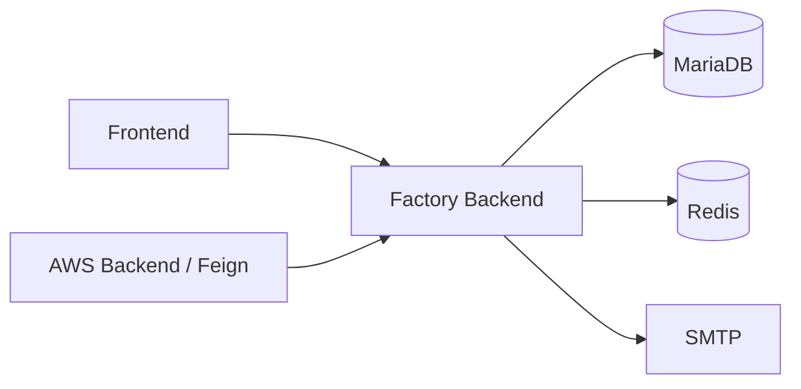

# Factory Tycoon - Backend

**한국어** | [English](README.en.md)

Factory Tycoon은 공장 운영 관리, IoT 센서 모니터링, 이상 탐지, AI 분석을 연결하는 스마트 팩토리 팀 프로젝트입니다. 여러 저장소가 데이터 수집부터 웹 화면과 클라우드 배포까지 역할을 나누어 구성합니다.

**공장 운영 데이터를 관리하는 Spring Boot REST API입니다.** 프론트엔드와 AI 서비스가 사용하는 공장, 설비, 작업, 센서, 알람 데이터를 관리하고 사용자 인증을 제공합니다.

## 주요 구현

- **공장 운영 모델**: 공장, 설비, 작업 지시, 주문, 재고, 일정 관리 API
- **센서와 알람**: 센서 데이터, 분석 결과, 알람 및 예측 데이터 관리
- **인증과 계정**: JWT 발급과 검증, Redis 기반 토큰 관리, 이메일 인증
- **데이터 계층**: JPA를 통한 관계형 데이터 접근과 Flyway SQL 마이그레이션
- **API 문서화**: Springdoc OpenAPI와 Swagger UI

## 서비스 역할



운영 데이터를 이 서비스에 모으고, Bedrock 호출과 파일 저장은 별도의 AWS 백엔드에서 처리합니다.

## 기술 스택

Java 17, Spring Boot 3.5.8, Spring Data JPA, MariaDB, Redis, Flyway, JWT, Docker

## 로컬 실행

JDK 17과 Docker Compose가 필요합니다. 저장소 루트의 `.env`에 다음 값을 설정합니다. 아래 DB 접속 값은 포함된 로컬 Compose 설정에 맞춘 개발용 예시입니다.

```dotenv
MARIADB_URL=jdbc:mysql://localhost:3306/factory-tycoon
MARIADB_USERNAME=user
MARIADB_PASSWORD=1234
REDIS_HOST=localhost
REDIS_PORT=6379
JWT_SECRET_KEY=replace-with-a-long-random-secret-for-local-development
JWT_ACCESS_TTL_MS=3600000
JWT_REFRESH_TTL_MS=86400000
SPRING_MAIL_HOST=your-smtp-host
SPRING_MAIL_USERNAME=your-smtp-username
SPRING_MAIL_PASSWORD=your-smtp-password
```

SMTP 값은 사용할 메일 서버에 맞게 바꿉니다. 설정 전체는 [application.yaml](src/main/resources/application.yaml)을 참고하세요.

저장소 루트에서 실행합니다.

```bash
docker compose -f docker/local/docker-compose.yml up -d mariadb redis
./gradlew bootRun
```

- API: `http://localhost:8080`
- Swagger UI: `http://localhost:8080/swagger-ui/index.html`
- 테스트: `./gradlew test` — 애플리케이션 컨텍스트를 사용하는 테스트에는 관련 환경 설정과 서비스가 필요합니다.

## 코드 살펴보기

- [src/main/java/com/factory/tycoon](src/main/java/com/factory/tycoon): 기능별 컨트롤러, 서비스, 저장소 및 도메인
- [auth](src/main/java/com/factory/tycoon/auth): JWT와 Redis 토큰 처리
- [db/migration](src/main/resources/db/migration): 데이터베이스 마이그레이션
- [docker/local](docker/local): 로컬 DB, 캐시와 백업 구성

## 배포

[GitHub Actions](.github/workflows/deployment.yml)는 컨테이너 이미지를 ECR에 올리고 Kubernetes 저장소의 Helm 이미지 태그를 갱신하도록 구성되어 있습니다. 배포 구성은 Kubernetes 및 Cloud 저장소와 연결되어 있습니다. 워크플로에 이전 조직(`lgcns5team`) 주소가 남아 있으므로 재사용 시 대상 저장소와 Secrets를 확인해야 합니다.

## 관련 저장소

| 저장소 | 역할 |
| --- | --- |
| [factory-tycoon-frontend](https://github.com/factorytycoon/factory-tycoon-frontend) | 웹 대시보드와 3D 공장 시각화 |
| [factory-tycoon-backend](https://github.com/factorytycoon/factory-tycoon-backend) | 공장 운영 데이터와 인증 API |
| [factory-tycoon-backend-aws](https://github.com/factorytycoon/factory-tycoon-backend-aws) | Bedrock AI 분석과 S3 및 OpenSearch 연동 |
| [factory-tycoon-backend-websocket](https://github.com/factorytycoon/factory-tycoon-backend-websocket) | 센서와 알람 실시간 전송 |
| [factory-tycoon-sensor-simulator](https://github.com/factorytycoon/factory-tycoon-sensor-simulator) | 가상 센서 데이터 생성과 MQTT 전송 |
| [factory-tycoon-opensearch](https://github.com/factorytycoon/factory-tycoon-opensearch) | 이상 탐지와 알람 설정 자료 |
| [factory-tycoon-cloud](https://github.com/factorytycoon/factory-tycoon-cloud) | Terraform 기반 AWS 인프라와 Lambda |
| [factory-tycoon-k8s](https://github.com/factorytycoon/factory-tycoon-k8s) | Helm과 Kubernetes 배포 구성 |
